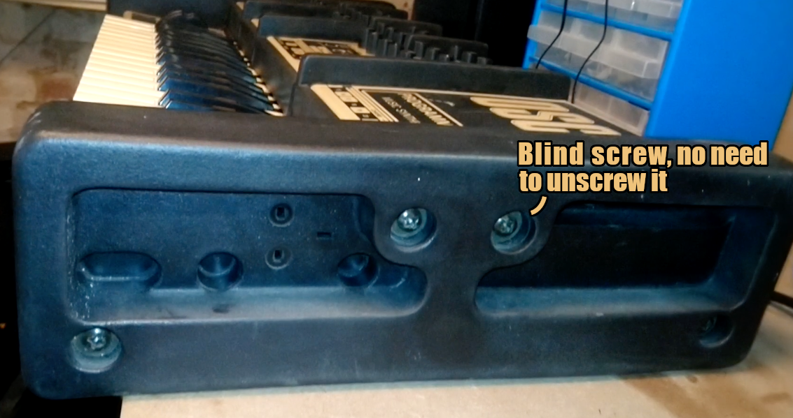
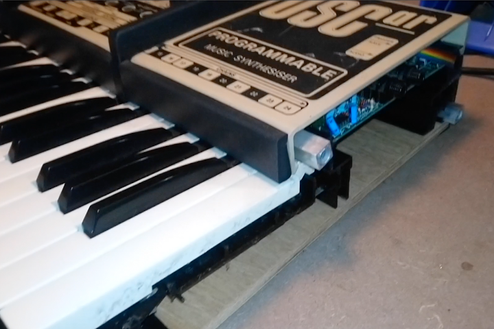

# Opening and disassembling

The OSCar is a highly unusual design, and consists of a plywood bottom,
a few plastic profiles including the front panel.
These are all held together with the big rubber sides,
which in turn are held together by long screws that are screwed into three metal rods that span the width of the synthesizer.

Opening the OSCar is made by unscrewing three of the four screws on each side. Of the top tow screws on each side, the screw towards the back isn't attached to anything but a nut, and can be ignored.

You can now see the ends of the three metal bars that hold everything together. The center bar holds the keybed and front panel in place. Once you have unscrewed it from both side panels you can gently slide it out.

